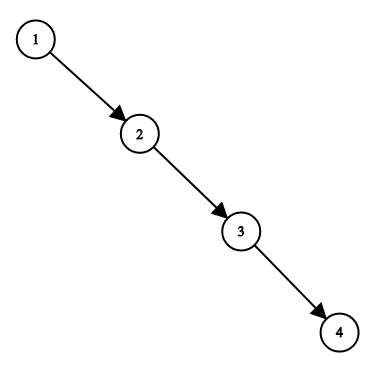
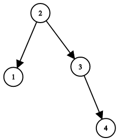

1382. Balance a Binary Search Tree
Given a binary search tree, return a balanced binary search tree with the same node values.

A binary search tree is balanced if and only if the depth of the two subtrees of every node never differ by more than 1.

If there is more than one answer, return any of them.

Example 1:

Input: root = [1,null,2,null,3,null,4,null,null]
Output: [2,1,3,null,null,null,4]
Explanation: This is not the only correct answer, [3,1,4,null,2,null,null] is also correct.

Constraints:

The number of nodes in the tree is between 1 and 10^4.
The tree nodes will have distinct values between 1 and 10^5.